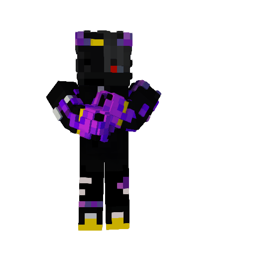
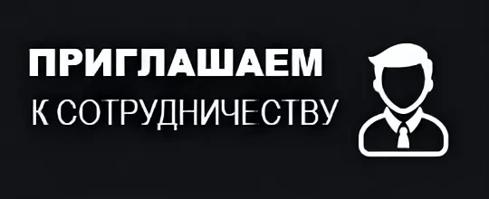

# 🧑‍💻 Представители

***

Александр Александрович Канстантинавичь

Создатель этого сайта и также крупных проектов

Также есть Официальный Бот и Сайты











<figure><figcaption></figcaption></figure>

***

Модары

Се наши - {Модары} - Проекта

***

Модер - Даня - Помощник {Владельца}

Данил Владимирович - Помощник и модератор бота







***

Модер

Кирилл - Модерирует ВК группу&#x20;







<figure><figcaption></figcaption></figure>

***

<figure><figcaption></figcaption></figure>
