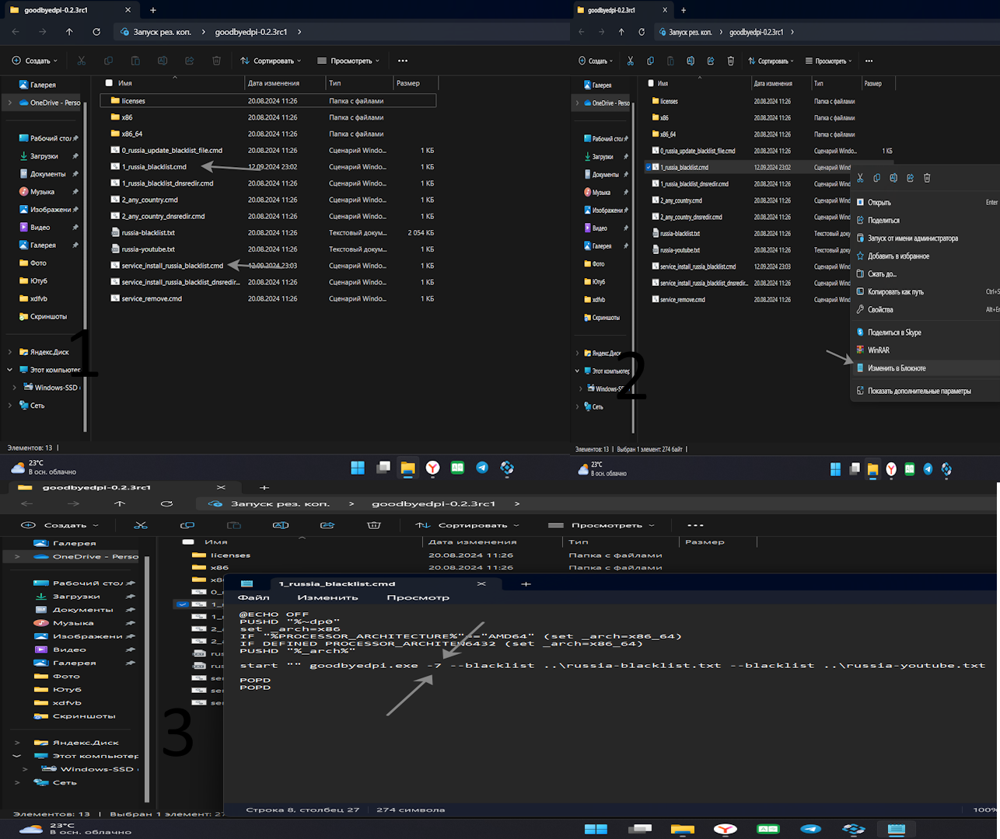

# 📌 Гит Хап




***

&#x20;                                                       Обход лагов и замедление - YouTube -  (1.09.2024 Года)



<figure><figcaption></figcaption></figure>


<figure><figcaption></figcaption></figure>

&#x20;                                                                                **Инструкция**&#x20;

<details>

<summary>Вот для компа, я себе такое тоже сделал 👇🏻</summary>

Оживляем YouTube — добрые люди уже выложили&#x20;

(https://github.com/ValdikSS/GoodbyeDPI/issues/378) гайд.

• Скачиваем GoodbyeDPI (https://github.com/ValdikSS/GoodbyeDPI/releases/tag/0.2.3rc1) с GitHub;&#x20;

• Запускаем файл 1\_russia\_blacklist.cmd. Если выбивает ошибку, запускаем от имени администратора (для этого надо правой кнопкой мыши нажать на файл,там будет плашка), либо жмём «Подробнее» — «Выполнить»;&#x20;

• Теперь в браузере нужно вырубить Kyber – пишем в адресной строке chrome://flags, находим и вырубаем. • Наслаждаемся победой.

</details>

***

```
Как обойти замедление YouTube - Способ 2

( 📱Вот мои випины для телефона на Play Market:
1. https://play.google.com/store/apps/details?id=free.vpn.proxy.secure - (Google Play - 1.09.2024 Года)
2. https://play.google.com/store/apps/details?id=com.now.vpn - (Google Play - 1.09.2024 Года)

( 💻 А вот для компьютера расширение
1. https://minecrafters-organization.gitbook.io/officialwebsitesashaminecraft/stranicy/git-khap - (Наш Сайт - 1.09.2024 Года)
2. https://chromewebstore.google.com/detail/hola-vpn-your-website-unb/gkojfkhlekighikafcpjkiklfbnlmeio (Расширение - 1.09.2024 Года)
3. https://chromewebstore.google.com/detail/vpn-для-youtube/bojaonpikbbgeijomodbogeiebkckkoi?snuoi (Расширение - 18.09.2024 Года)
3.3 https://chromewebstore.google.com/detail/блокировщик-рекламы-для-y/pginoclcfbhkoomedcodiclncajkkcba?snuoi (Расширение - 18.09.2024 Года)
И ещё один комментарий YouTube не заблокировали пока что, его замедляют.
```



***

&#x20;                                                                <mark style="color:yellow;">**Ска**</mark><mark style="color:green;">**чать**</mark>** **<mark style="color:orange;">**янд**</mark><mark style="color:purple;">**екс**</mark> <mark style="color:red;">**Бра**</mark><mark style="color:blue;">**узер**</mark>

{% embed url="https://yandex.ru/project/browser/brand/s/brw_ya_01?utm_term=%D1%81%D0%BA%D0%B0%D1%87%D0%B0%D1%82%D1%8C%20%D1%8F%D0%BD%D0%B4%D0%B5%D0%BA%D1%81&banerid=0600005800&utm_campaign=search_brand_ru_2%7C55140847&utm_medium=search&from=direct_serp&etext=2202.q7pNZ20tBoBzKu2c84I-gT-_5vrLzsfpDjYCnURAQDciQALbjfXPFQR-pwpqLXV_aXBlenhtZG1na2FsaGl4Yg.b1c48569b6fa1d7f4e577a94b4b961828ce12d2e&yclid=7873275566224048127&utm_content=5488537567%7C16466185603&utm_source=yandex" %}

***

